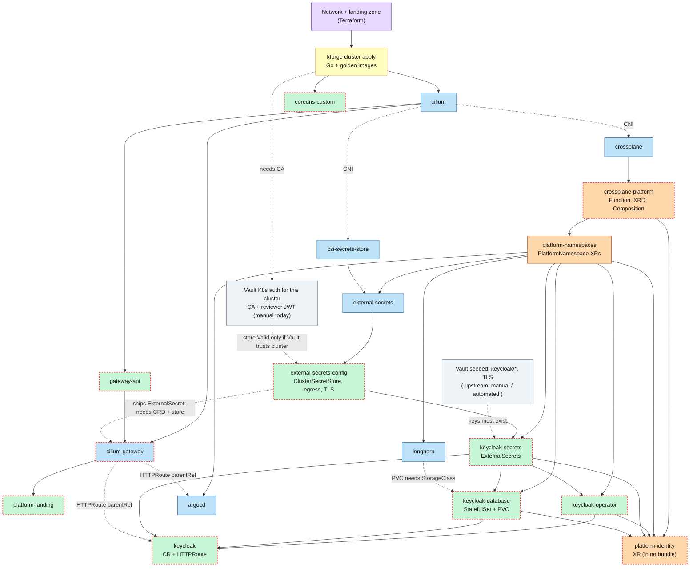
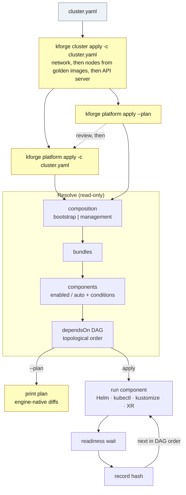
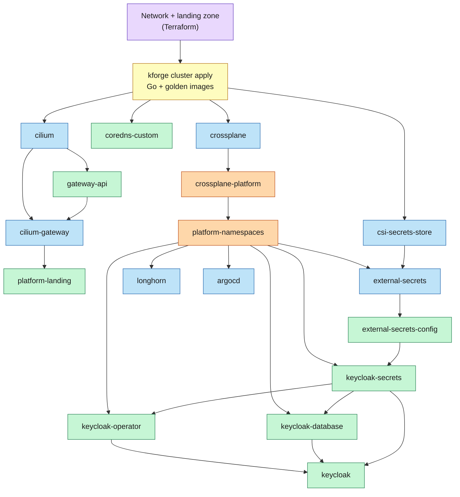

```mermaid
flowchart TD
    net["Network + landing zone<br/>(Terraform)"]
    cluster["kforge cluster apply<br/>Go + golden images"]
    vauth["Vault K8s auth for this cluster<br/>CA + reviewer JWT (manual today)"]
    vseed["Vault seeded: keycloak/*, TLS<br/>( upstream; manual / automated )"]

    cilium["cilium"]
    gwapi["gateway-api"]
    cgw["cilium-gateway"]
    landing["platform-landing"]
    coredns["coredns-custom"]
    xp["crossplane"]
    xpp["crossplane-platform<br/>Function, XRD, Composition"]
    pns["platform-namespaces<br/>PlatformNamespace XRs"]
    csi["csi-secrets-store"]
    eso["external-secrets"]
    esoc["external-secrets-config<br/>ClusterSecretStore, egress, TLS"]
    ksec["keycloak-secrets<br/>ExternalSecrets"]
    kop["keycloak-operator"]
    kdb["keycloak-database<br/>StatefulSet + PVC"]
    kc["keycloak<br/>CR + HTTPRoute"]
    pid["platform-identity<br/>XR (in no bundle)"]
    lh["longhorn"]
    argo["argocd"]

    net --> cluster
    cluster --> cilium
    cluster --> coredns
    cilium --> gwapi
    cilium --> cgw
    gwapi --> cgw
    cgw --> landing
    xp --> xpp
    xpp --> pns
    pns --> eso
    csi --> eso
    eso --> esoc
    pns --> ksec
    esoc --> ksec
    pns --> kop
    ksec --> kop
    pns --> kdb
    ksec --> kdb
    kop --> kc
    kdb --> kc
    ksec --> kc
    xpp --> pid
    pns --> pid
    kop --> pid
    ksec --> pid
    kdb --> pid
    pns --> lh
    pns --> argo

    cilium -. "CNI" .-> xp
    cilium -. "CNI" .-> csi
    cluster -. "needs CA" .-> vauth
    vauth -. "store Valid only if Vault trusts cluster" .-> esoc
    vseed -. "keys must exist" .-> ksec
    esoc -. "ships ExternalSecret: needs CRD + store" .-> cgw
    lh -. "PVC needs StorageClass" .-> kdb
    cgw -. "HTTPRoute parentRef" .-> kc
    cgw -. "HTTPRoute parentRef" .-> argo

    class net terraform
    class cluster kforge
    class vauth,vseed external
    class cilium,xp,csi,eso,lh,argo helm
    class pns crossplane
    class cgw helmNW
    class gwapi,landing,coredns,esoc,ksec,kop,kdb,kc k8sNW
    class xpp,pid cpNW

    classDef terraform fill:#e9d8fd,stroke:#6b46c1,color:#1a1a1a
    classDef helm fill:#bee3f8,stroke:#2b6cb0,color:#1a1a1a
    classDef crossplane fill:#fed7aa,stroke:#c05621,color:#1a1a1a
    classDef kforge fill:#fefcbf,stroke:#b7791f,color:#1a1a1a
    classDef external fill:#edf2f7,stroke:#718096,color:#1a1a1a
    classDef helmNW fill:#bee3f8,stroke:#e53e3e,stroke-width:2px,stroke-dasharray:4 3,color:#1a1a1a
    classDef k8sNW fill:#c6f6d5,stroke:#e53e3e,stroke-width:2px,stroke-dasharray:4 3,color:#1a1a1a
    classDef cpNW fill:#fed7aa,stroke:#e53e3e,stroke-width:2px,stroke-dasharray:4 3,color:#1a1a1a
```

Command flow

```mermaid
flowchart TD
    cfg["cluster.yaml"]
    capply["kforge cluster apply -c cluster.yaml<br/>network, then nodes from golden images, then API server"]
    pplan["kforge platform apply --plan"]
    papply["kforge platform apply -c cluster.yaml"]

    cfg --> capply
    capply --> pplan
    capply --> papply
    pplan -. "review, then" .-> papply

    papply --> r1
    pplan --> r1

    subgraph R["Resolve (read-only)"]
        direction TB
        r1["composition<br/>bootstrap | management"] --> r2["bundles"]
        r2 --> r3["components<br/>enabled / auto + conditions"]
        r3 --> r4["dependsOn DAG<br/>topological order"]
    end

    r4 -->|"--plan"| diff["print plan<br/>engine-native diffs"]
    r4 -->|"apply"| e1["run component<br/>Helm · kubectl · kustomize · XR"]
    e1 --> e2["readiness wait"]
    e2 --> e3["record hash"]
    e3 -->|"next in DAG order"| e1

    class cfg external
    class capply,pplan,papply,diff kforge
    classDef external fill:#edf2f7,stroke:#718096,color:#1a1a1a
    classDef kforge fill:#fefcbf,stroke:#b7791f,color:#1a1a1a


```

```mermaid
flowchart TD
    net["Network + landing zone<br/>(Terraform)"]
    cluster["kforge cluster apply<br/>Go + golden images"]

    cilium["cilium"]
    gwapi["gateway-api"]
    cgw["cilium-gateway"]
    landing["platform-landing"]
    coredns["coredns-custom"]
    xp["crossplane"]
    xpp["crossplane-platform"]
    pns["platform-namespaces"]
    csi["csi-secrets-store"]
    eso["external-secrets"]
    esoc["external-secrets-config"]
    ksec["keycloak-secrets"]
    kop["keycloak-operator"]
    kdb["keycloak-database"]
    kc["keycloak"]
    lh["longhorn"]
    argo["argocd"]

    net --> cluster
    cluster --> cilium
    cluster --> coredns
    cluster --> xp
    cluster --> csi

    cilium --> gwapi
    cilium --> cgw
    gwapi --> cgw
    cgw --> landing

    xp --> xpp
    xpp --> pns

    pns --> eso
    csi --> eso
    eso --> esoc

    pns --> ksec
    esoc --> ksec
    pns --> kop
    ksec --> kop
    pns --> kdb
    ksec --> kdb
    kop --> kc
    kdb --> kc
    ksec --> kc

    pns --> lh
    pns --> argo

    class net terraform
    class cluster kforge
    class cilium,cgw,xp,csi,eso,lh,argo helm
    class gwapi,landing,coredns,esoc,ksec,kop,kdb,kc k8s
    class xpp,pns crossplane

    classDef terraform fill:#e9d8fd,stroke:#6b46c1,color:#1a1a1a
    classDef helm fill:#bee3f8,stroke:#2b6cb0,color:#1a1a1a
    classDef k8s fill:#c6f6d5,stroke:#2f855a,color:#1a1a1a
    classDef crossplane fill:#fed7aa,stroke:#c05621,color:#1a1a1a
    classDef kforge fill:#fefcbf,stroke:#b7791f,color:#1a1a1a
```