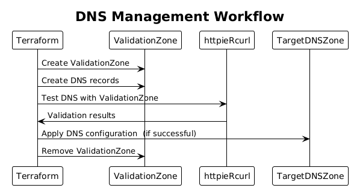
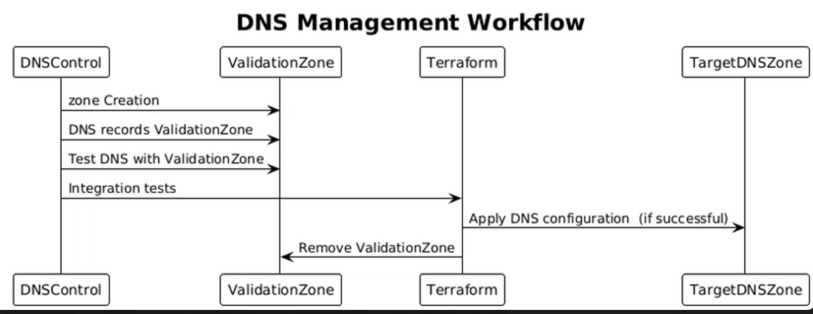

Terraform can automate most of this infra at scale but one aspect that it lacks is management of DNS in a complex setup in which one often need additional capabilities to test and validate before plan is applied.
There are multiple scenarios in which lack of this capability makes it hard to customize DNS and hard not get into troubles. 

A back and forth deployment to keep DNS records, zones in sync

## Temporary zone and validate before apply 

DNScontrol gives lot of flexibility to mange DNS zones across clouds and needs more control.

If Terraform already manages your infrastructure, **use Terraform alone by default**,add **DNSControl** only when you have a clear DNS-specific requirement that Terraform does not handle well.

| Concern | Terraform only | Terraform + DNSControl |
| --- | --- | --- |
| Configuration language | HCL | HCL plus DNSControl's JavaScript DSL |
| State | Terraform state | Terraform state plus DNSControl's live provider comparison |
| Workflow | **Plan** → **Review** → **Apply** | Terraform plan plus DNSControl preview and push |
| DNS records tied to infrastructure | Excellent | Good, but requires coordination |
| Complete zone management | Good with a mature provider | Strong DNS-specific workflow |
| Multi-provider DNS | Depends on provider support and architecture | Well suited to multi-provider environments |
| Drift detection | Terraform refresh and plan | Direct comparison of desired and existing DNS records |
| Team complexity | Lower | Higher |
| Risk of conflicting ownership | Low when one Terraform state owns the zone | Higher unless ownership is clearly divided |
| Best fit | One cloud or provider, standard records, infrastructure-focused teams | DNS-heavy environments, many zones, multiple providers, and reusable DNS policies |

- Use terraform to create temporary DNS zone
- Use `curl` or `https://httpie.io/` to validate the DNS entries
- This setup ensures DNS changes are tested and impact is known

- Each provider has their own SDK, format that they support and API; for example terraform has no 
  zone file import while azure does, besides integration tests are non exist and complex to craft, mostly simple nslookup validation.

DNScontrol and Terraform are both powerful tools for managing DNS records, but they have different capabilities and use cases. Let's use them together to make a DNS management predictable and fault proof.

- Designed specifically for DNS: DNScontrol is tailored for DNS management, offering features and integrations that are optimized for DNS-related tasks.
- Flexibility: It provides a high level of flexibility, allowing you to define DNS records using various formats (e.g., YAML, JSON) and supports a wide range of DNS providers.

You could leave whole DNS management to DNSControl or use it for complex validations and DNS records mgmt and use AZ CLI to export and import in a CI/CD task with necessary approval flows +/- terraform.

