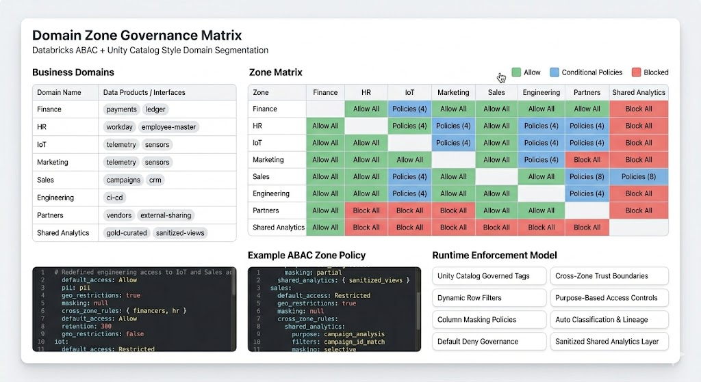

Databricks reached an important milestone with ABAC governance: it helps govern Databricks-bound data assets. Engineers combined long-established data domains, flexible tags, and ML-based classification to deliver a nice ABAC capability.

ABAC answers the question: should user can see this data!? But business typically thinks in domains terms


```txt
Should this domain interact with another domain—under which trust model, through which interfaces, and for which purposes?

ABAC partially addresses these questions and is a strong first step toward better governance, helps in policy enforcement but what domain context requires in addition that is governance orchestration.

We had this problem in Kubernetes too: it provides containers, scheduling, and networking primitives, but enterprises need service mesh, operators, and topology orchestration to make it a complete solution.
```

 Recently, i spent sometime with firewalls, network segmentation, zone concepts that i saw there picked my interest on how closely they are related and how ABAC based governance can evolve further into  topology based governance later for Agentic era.

# Background

Initially started with #OPNsense and then moved to Ubiquity UDR7, fortunately i have few custom policies, an enterprise scale can be huge with 1000s of policies, difficult to comprehend and manage.

Firewall appliance vendors implemented a nice zone based defaults and users can define custom policies for zone matrix; Same concerns,this zone based policy approach evolved in 2004-2010 and vendors like zscalar, cisco etc all later added another layer, identity and context-based policies for zero trust approach.

How this relates to ABAC that Databricks made GA?, for me they address same concerns but different domains, similar security concerns and trust domains that they handle differ thus implementation details, yet at core the goals are same.
Data Segmentation

While dealing with data domains, Instead of network packets, IP's, VLAN's, VXLAN and ports, data stewards, engineers manage datasets, domains, storage mounts, API endpoints and gateway access.

Until recently, Unity Catalog primarily used roles and grants familiar to ETL, DWH, and OLTP practitioners and has since been augmented with ML-based classification

Recent Unity Catalog and ABAC changes alleviate operational burdens such as:

    - table-by-table ACL sprawl
    - view proliferation
    - manual masking
    - duplicated governance logic

The key architectural shift enabled by ABAC is: “govern once, apply everywhere”

If desired, teams can build a similar custom ABAC layer with tools like Casbin; a proxy between consumers and data sources can enforce ABAC policies. 
Next evolution

In my view, Databricks and its users should evolve toward enterprise-scale, domain- and zone-based governance with zone maps and templates similar to what vendors like Zscaler implemented to simplify policy management and meet complex governance requirements

Databricks currently offers tags, inheritance, masking, row filters, also time* based access; from what i observed in the gif.

The agentic era requires:

    - topology based domain trust maps
    - default deny governance planes
    - inheritance precedence
    - composable policies

With current ABAC, you still think in:  tables, columns, tags, an object explorer rather than an interactive governance topology where one could design

    - security domains
    - trust boundaries
    - governance intent

# Topology-aware governance 

A topology aware governance that maps business domains into discrete business zone mappings and domain templates could simplify policy expression and enforcement.

Databricks with ABAC is almost there, next small bump is :

    - topology-oriented 
      + UX
    - zone-oriented policy   
      orchestration
    - domain templates
    - policy composition

Many data engineers lack domain expertise, while business users have it; both need an intuitive UX to collaboratively create zone-oriented domain mappings and templates that feed the policy engine to produce inheritable, customizable policies

- From resource-attached policies → policies generated from organizational topology
- From resource-attached policies → policies generated from organizational topologyDevelopers should be able to define templates or zone mappings and drag-and-drop them into security domains so default policies apply automatically, with the option to add custom policies based on domain context.

Not intended to represent domain realities; this is a mapping concept.

## *Intent /Topology based* 


    - From catalog.schema.table → Domain → Purpose → Trust Boundary

    - from policy attached to resources to policy generated from organizational topology

An intent and topology-driven governance model seems pretty much needed. Niche products exist that address parts of this scope; some are mature, others are evolving on top of base platforms.

Some solutions outperform Unity Catalog in specific areas, but No single platform fully solves the entire scope yet.

I prefer a third-party or CNCF solution that acts as a proxy and delivers cross-domain, cross-organizational governance rather than being embedded in every vendor offering. 

