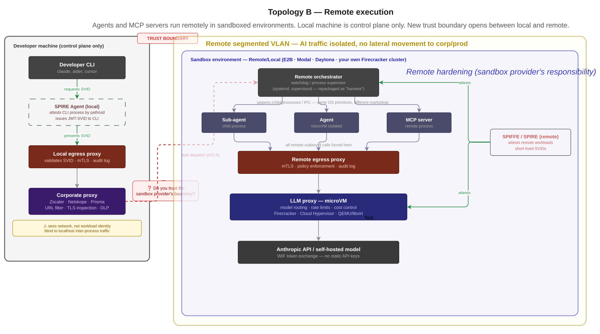

tldr:

```
Model providers are bringing established enterprise security primitives such as workload identity federation into AI infrastructure, but securing access to the model is only part of the problem. Developer machines still
run AI agents, MCP tools, plugins, scripts, and untrusted code alongside valuable credentials. 

This article argues for separating control from
execution through terminal-first interfaces, controlled egress, workload
identity, sandboxing, and remote microVM-based execution. 

The underlying primitives already exist. What is missing is an integrated, turnkey developer experience that composes them into a practical security boundary.
```

Enterprise security best practices are finally reaching AI infrastructure, but duct-taped at every layer by different players: 

- sandbox providers
- middlware vendors, 
- foundational model providers. 

## 𝐓𝐡𝐞 𝐧𝐨𝐦𝐞𝐧𝐜𝐥𝐚𝐭𝐮𝐫𝐞 𝐡𝐚𝐬 𝐛𝐞𝐞𝐧 𝐫𝐞𝐩𝐚𝐜𝐤𝐚𝐠𝐞𝐝. 

𝐓𝐡𝐞 𝐞𝐧𝐠𝐢𝐧𝐞𝐞𝐫𝐢𝐧𝐠 principles are still same.

- "𝐀𝐠𝐞𝐧𝐭𝐬" → processes / threads 
- "𝐒𝐮𝐛-𝐚𝐠𝐞𝐧𝐭𝐬" → child processes with IPC 
- "𝐀𝐠𝐞𝐧𝐭𝐢𝐜 𝐩𝐢𝐩𝐞𝐥𝐢𝐧𝐞𝐬" → DAGs 
- "𝐇𝐚𝐫𝐧𝐞𝐬𝐬" → a watchdog / process supervisor (systemd, supervisord) 

All that shipped by 𝐎𝐒 𝐞𝐧𝐠𝐢𝐧𝐞𝐞𝐫𝐬 𝐝𝐞𝐜𝐚𝐝𝐞𝐬 𝐚𝐠𝐨, "Not a new abstraction" but new flavour.

 ## 𝐖𝐡𝐚𝐭 is 𝐠𝐞𝐧𝐮𝐢𝐧𝐞𝐥𝐲 𝐧𝐞𝐰: 
 
 Foundational models, rest is good old software engineering process and some nice frameworks for Orchestration.

In continuation to that now cryptographic workload identity finally reaching the model-provider layer. 

Anthropic's Workload Identity Federation is a real upgrade,  SPIFFE/SPIRE-style attestation replacing static sk-ant-* API keys. 

Your workload presents a short-lived JWT-SVID; Anthropic validates it and mints a scoped access token. No long-lived secrets. But let's be precise about what it covers.

That's an important milestone but for a developer's terminal invoking Claude Code or aider, SPIRE Agent would need to run on the Dev machine and attest the CLI process as a registered workload. 

Technically possible. Operationally heavy for a laptop. Not what it's built for, that's the risk one has to handle for all vibe coders in your organization; set side that fat $$$ BILL OpenAI, Anthropic send you at end of the month

An average development session uses 

    A numerous plugins, CLI tools

    MCP tool invocations, scripts on local host

    GitHub tokens, LLM API keys, cloud credentials all sitting in env vars. 

One compromised plugin or trial run of a vibe-coded GitHub ⭐ projects backed by VC money and shipped without a real audit ; the host is owned, The developer may not even notice.

> The security boundary isn't at the model provider. It's 𝐚𝐭 𝐭𝐡𝐞 𝐝𝐞𝐯𝐞𝐥𝐨𝐩𝐞𝐫'𝐬 𝐦𝐚𝐜𝐡𝐢𝐧𝐞.

Using isolated sandboxes, going CLI first brings control back to the developers and peace to the security team, hence influx of sandbox providers, CLI tools, SDK etc.. 

Why CLI-first?

→ Clean interception point ; proxy-friendly by design 

→ No ambient host credential leakage 

→ Policy, audit logging, egress control — without touching app code 

→ Developers reason in pseudo code; the secure path is handled underneath 

The primitives exist: Firecracker, Cloud Hypervisor, flintlock, gVisor; the list is long. 

    None of them are end-to-end. That's the gap. The primitives exist. The composition is what's missing, until someone ships this end-to-end — not duct-taped, not a niche cloud wrapper , developer machines remain the weakest link in the AI security chain.

Most developers use their own IDE, workstation, numerous plugins in those IDE's and SDK's , utilities and terminal tools. corporate proxy designed to scan known vulnerabilities and not exfiltrate tokens, tool calls

Below are the possibilities with available primitives that lets a developer to consume ai minimizing attack surfaces , primarily using microVM isolation as the runtime environment and proxy setup to skip host.

It's achievable today without waiting for sandbox providers to mature

## *(re)local execution* 


    Local machine is control plane only — CLI dispatches tasks


The gap: Firecracker · gVisor · Flintlock · Edera · Cloud Hypervisor · Open Computer. nono, xyz... — none are end-to-end, each solving sub context of whole vibe coding dev environment.

    The primitives exist. The composition is missing.

Proxies in a sandbox + SPIRE attestation is composable TODAY using existing primitives. Nobody has shipped yet as a turnkey developer vibe code product.

Note: 
SPIRE on the developer machine is high-assurance optional. For most teams, iptables egress rules + a local LLM proxy + corporate proxy gives you 80% of the security benefit with 20% of the operational overhead. SPIRE belongs at the workload layer — your remote execution environment, your CI runners, your API-consuming services — not necessarily on every developer laptop.


A capable team hosting code servers, TUI coding tools in a K8S and per-configured Terminal first AI Vibe coding environment in which every command/CLI runs in an isolated network and task execution runs in microvms long/ephemeral addresses most of the concerns.

- A new tool that  optimizes token consumption need not be running in 
   all dev machines
- No need to run a risk of exposing dev workstation to plugins and CLI tools that are not vetted.
- Not every Dev/ power user ponder on \ how to do it

We used to do that! , corporate support team shipping software, configuring numerous machines with all the tooling! why should it be different?

Remote execution is where industry is going Agents and MCP servers run remotely — in a sandbox provider's infrastructure (E2B, Modal, Daytona, etc.), or in your own Firecracker/QEMU cluster.

    The developer CLI sends a task to a remote orchestration

    The remote environment has its own hardening — microVM isolation, its own egress policy, its own identity

    The local machine is just the consumer, not the control plane or execution plane

Middle-ground; until organization deploys a secure remote orchestration solution, developers better argued to pivot to terminal first Dev tools like neovim, tmux etc.. 

Terminal-first tools give developers the primitives to compose their own security boundary today — process isolation, transparent proxying, namespace sandboxing — without waiting for vendors. 

On Linux/WSL2 this is entirely achievable. The catch: it requires deliberate setup. The gap isn't capability, it's that nobody has packaged this as a turnkey developer workflow.

Terminal-first tools (neovim, tmux, etc ) have a fundamental security property that Electron-based IDEs don't — they're just processes. Clean, inspectable, proxyable. No embedded browser engine, no Node.js runtime with its own network stack, no auto-updating extension marketplace pulling code from the internet.

On WSL2/Linux you get:

iptables / nftables — egress rules per process or UID

    firejail / bubblewrap — lightweight sand boxing without a hypervisor

    proxychains or transparent proxy via iptables REDIRECT — forces all traffic through your LiteLLM proxy without touching tool config

    Process namespaces — isolate the dev environment from the host

    No GUI attack surface

A developer on WSL2 running neovim + tmux + proxychains + a local LiteLLM instance has more meaningful security control than a developer running VS Code with 40 extensions and Claude/Copilot plugins talking directly to APIs

Ofcourse terminal-first doesn't eliminate the risk — it reduces the attack surface and increases controllability. 

    Neovim plugins (from GitHub) carry the same supply chain risk as VS Code extensions — the vector is the same, just smaller ecosystem

    WSL2 shares the Windows network stack — a compromise on the Windows side can still see WSL2 traffic

    proxychains can be bypassed by tools that use raw sockets or UDP

    The discipline required to maintain this setup is high — 

Most developers won't do it without tooling that makes it easy, but Terminal-first isn't just a security stopgap — it's the right interface contract. 

The CLI doesn't care whether the execution is local or remote, isolated or bare metal. When your organization ships hardened remote execution, terminal-first developers are already aligned. Nothing changes for them except where the work runs.
Conclusion

    The "vibe coding" era has introduced a massive security regression, trading workstation integrity for development velocity. While foundational model providers are finally implementing mature identity protocols like Workload Identity Federation, these tools only secure the "last mile." The real battlefield is the developer’s local environment, currently cluttered with plugins and their ambient credentials.

The industry is currently in a "duct-tape" phase, but the path forward is clear: decoupling execution from the control plane. By moving toward remote, microVM isolated execution and adopting terminal-first tools that respect standard Unix process boundaries, organizations can embrace agentic workflows without turning every developer's laptop into a supply-chain vulnerability. The primitives exist; the winner will be the one who packages them into a turnkey, "zero-trust" developer experience

https://platform.claude.com/docs/en/manage-claude/workload-identity-federation 

#AI #EnterpriseAI #ZeroTrust #SPIFFE #DevSecOps #AIInfrastructure #OpenAI #SecurityEngineering #DeveloperSecurity


### Disclaimers

    Thoughts are original, LLM applied its flavour; while the thought process is ours, the voice and flavour are that of an LLM.

    To drive POV  

    Multiple topics and contexts exist, all related and relevant