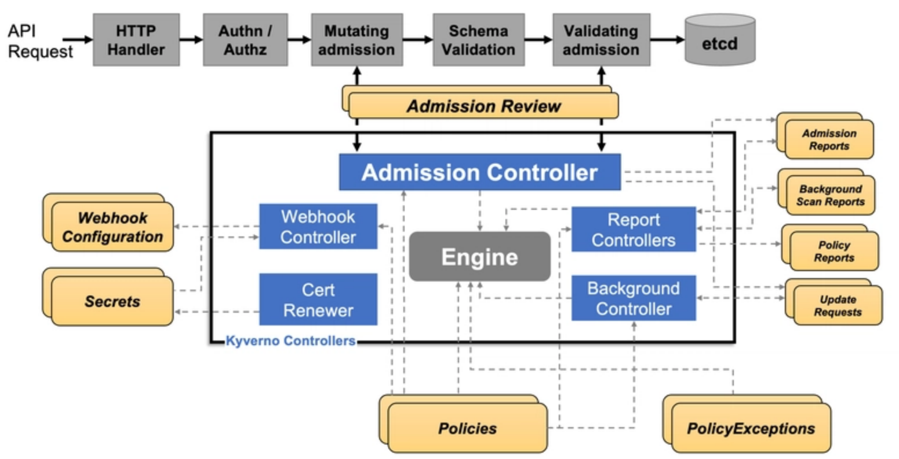

A config driven PaaS infra setup needs to extend kyverno policy coverage to other configuration items and at plan stage itself and as a pipeline, we hope to minimize config induced errors.

Kyverno-json bridges the gap by allowing you to apply Kyverno policies to validate any JSON or YAML data. 

## Kyverno-json

Kyverno-json opens doors to validating

  - Terraform files: Ensure your infrastructure configurations adhere to best practices and security 
    guidelines.
  - Dockerfiles: Validate image builds for compliance and prevent potential vulnerabilities.
  - Cloud configurations: Maintain consistency and avoid errors across your cloud infrastructure.
  - Authorization requests: Enforce granular access control at the request level.

## *Kyverno* 

## Beyond Deployment-Time Validation:

With kyverno-json, validation extends beyond deployment time:

*DevOps Pipelines:* Integrate seamlessly into your DevOps pipelines for continuous validation.
*Pre-commit hooks:* Enforce validation before code commits, catching errors early in the development cycle.
*Atlantis (Terraform PR Automation):* Enhance your Terraform pull request automation with robust validation capabilities., atlantis also doubles up as self service tool for developers.
*Makefiles:* Utilize kyverno-json in your makefiles for streamlined validation as part of your build process.

*Terraform* plan can be validated taking its JSON output and passing to CLI when complex validation is required.

*Terraform input validation* is limited, kyverno-json covers a lot more with *JMESPath* ; a query language for JSON.

