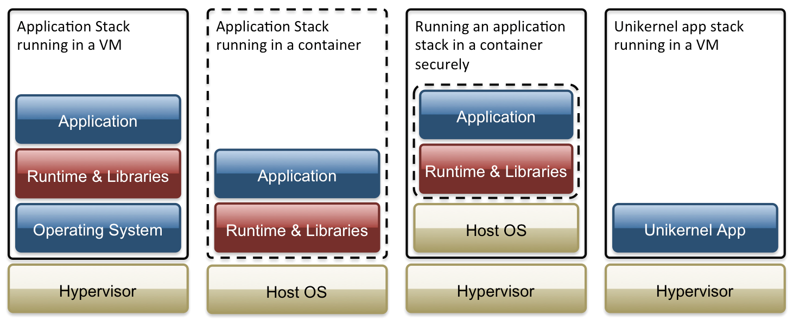

Security boundaries are no longer limited to containers and full virtual machines. Modern Linux platforms increasingly combine multiple isolation primitives to reduce attack surface while keeping startup times and resource usage low.

Rather than relying on a single layer of defense, lightweight virtualization and kernel-enforced sandboxing can work together to isolate workloads according to their risk profile.

## Choose the right isolation boundary

Different workloads require different guarantees.

Unikernels compile an application together with only the operating system components it actually needs. The resulting image has a dramatically smaller attack surface, minimal boot time, and very little unnecessary code.

MicroVMs provide hardware virtualization with startup times measured in milliseconds while consuming far fewer resources than traditional virtual machines. They combine the security benefits of virtualization with an execution model that is practical for short-lived workloads and serverless platforms.

Neither approach replaces containers entirely. Instead, they provide stronger isolation for workloads that execute untrusted code, process sensitive customer data, or require strict tenant separation.

## Add kernel-enforced sandboxing

Even within an isolated environment, applications should receive only the filesystem access they actually require.

Landlock enables unprivileged processes to restrict their own future filesystem operations using Linux Security Modules (LSM). Applications can voluntarily reduce their permissions before handling untrusted input, limiting the impact of potential vulnerabilities.

Bubblewrap complements this approach by constructing isolated process environments using Linux namespaces, bind mounts, and restricted filesystem views. Originally developed for desktop application sandboxing, it has become a practical building block for command execution, build systems, and developer tooling.

The combination creates defense in depth: virtualization protects the host boundary, while filesystem sandboxing minimizes what an application can access after it starts.

## Layer defenses instead of replacing them

Modern isolation works best when each layer solves a specific problem.

MicroVMs establish strong tenant boundaries.

Bubblewrap constructs a minimal execution environment.

Landlock limits filesystem capabilities even if the process is compromised.

The result is a system where an attacker must bypass multiple independent protection mechanisms rather than exploiting a single isolation boundary.

Instead of asking whether containers, virtual machines, or sandboxing are sufficient on their own, design systems that compose these technologies together. Small, purpose-built execution environments with least-privilege access provide a stronger foundation for secure infrastructure without sacrificing performance or developer experience.