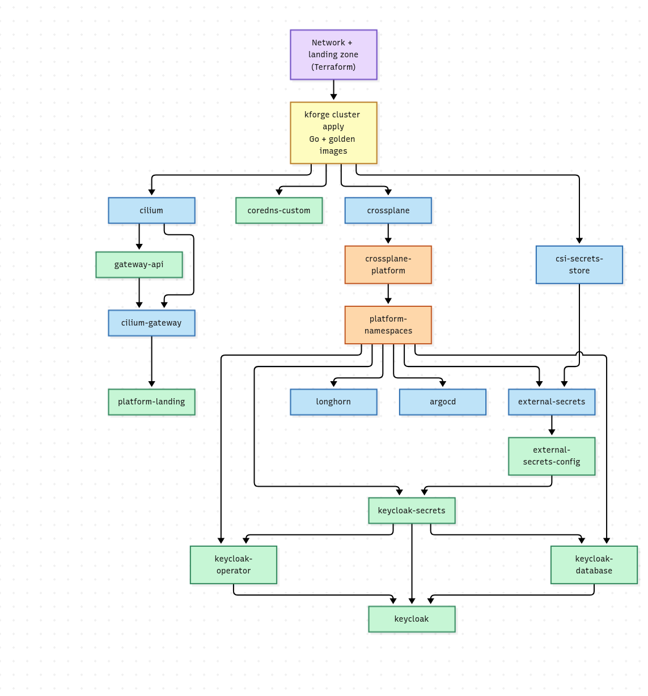
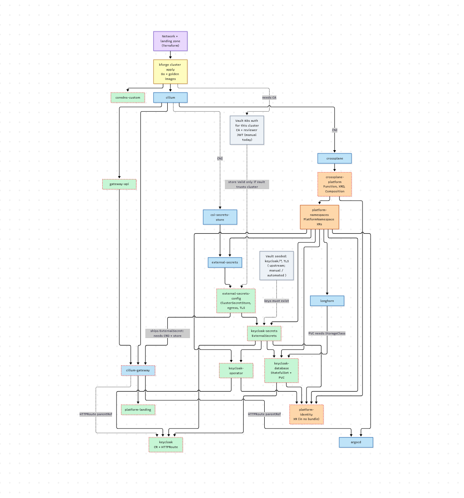
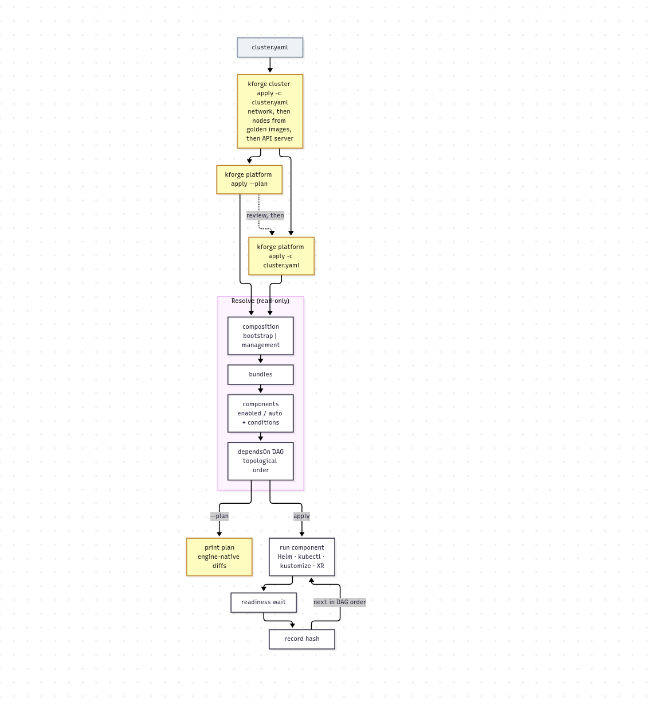
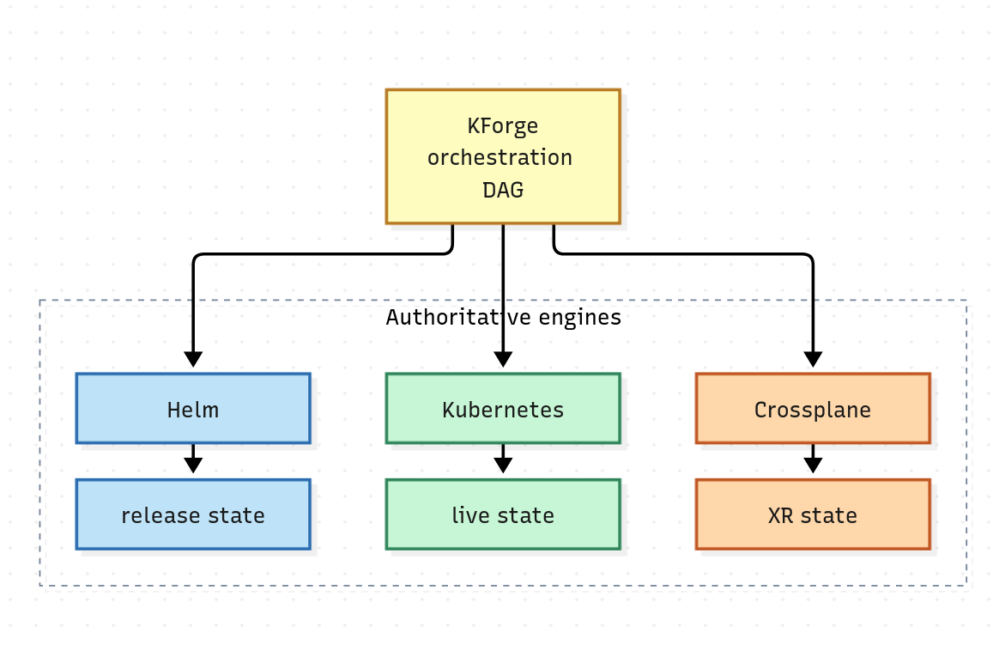

Got a self doubt if my platform bootstrapper solution duplicating what terraform natively provides. 

Kforge,a k8s orchastrator that bootstraps multi tenant production K8s cluster either on on-prem or cloud, seeds it with all tooling and capabilities to be a production cluster on it's own merit wth all bells and whistle and act as a K8S vending machine for tenants using ASO, CAPI, CAPZ, CAPMOX capabiities.

 Design goal was to maximize k8s composability and reconiliation capabilities and minimal terraform while not re-inventing what terraform provides.

The traditional IaC bootstrap workflow relies on iterative provisioning to untangle resource dependencies. Unfortunately, clean-slate environment redeployments frequently trigger recursive dependency loops and cascading debugging steps.

Consider a Keycloak rollout failure: a surface-level Helm issue often masks a deeper Kubernetes manifest misconfiguration, which itself is blocked by an upstream external resource or access policy gap

## The bootstrap graph nobody owns

Lately, a common modern shortcut is to use a pre-packaged bootstrap cluster like Kind or K3s. However, when the goal is to spin up a full-fledged production cluster—whether on-premise or in the cloud—with strict multitenancy and state/reconciliation delegated to GitOps, you inevitably need a proper, full-scale Kubernetes cluster.

While this might sound trivial on paper, enterprise prerequisites amplify complexity tenfold, demanding intricate dependency management and precise ordering.

This raises a critical question: If a GitOps or bootstrapping tool has to manage **dependency graph**, **ordering**, **readiness checks** and change detection, is it slowly turning back into Terraform? 

## No unified plan across engines.

Terraform, Helm, Crossplane, and Kubernetes each know a piece of this graph. 
None of them inherently owns the whole IaC lifecycle 🧨. 

Bridging that gap is the job of an orchestrator—one that must coordinate everything without reinventing the native capabilities of the stack it wraps. This delicate balancing act is precisely why so many organizations invest heavily in internal developer platforms (IDPs) or custom bootstrap engines.

#### Drifting and turning into a lighter version of Terraform ??

Notice that the Keycloak operator has two incoming edges: the namespace *and* the secrets.

The danger is drifting toward this list of responsibilities:

* a state database
* resource-by-resource state
* generic create/read/update/delete
* drift calculation
* resource dependency inference
* provider lifecycle
* import and refresh
* state migration
* locking

Each item is reasonable in isolation. Together they are a Terraform clone, and Terraform took years to get right and has a huge ecosystem behind it. A bootstrapper that rebuilds it loses that fight and ends up with a worse tool than the one it was avoiding.

The boundary is clear:

> **Stop before you track the state of every resource and try to transform it.**

## The architecture that stays on the right side

The alternative is for KForge to be an orchestrator of authoritative engines, not a state manager:

Engineers & architects that worked on IaC knew, its hard to avoid statefullness.

KForge does keep a little state, and it is worth being precise about it. Today it is a local file of component hashes, used to skip charts and manifests that are already applied. 

It holds no secrets and is not a source of truth. Once the cluster exists, that record moves into a ConfigMap in the cluster, keyed to the cluster's identity, so it lives and dies with the thing it describes. 

A fresh session reads it, then verifies against the engines, and the engines win any disagreement. Delete it and the cost is a slower run, never a wrong one.

Each engine already holds the truth about the things it manages, and KForge decides which one runs next. Later, ArgoCD can take over after bootstrap:

## One philosophy, three engines

The design holds up because every engine follows the same rule: **ask the engine, not your own records.**

**Helm.** A desired-component hash is compared against Helm's own release metadata, then `helm diff` and upgrade run as needed. This is lightweight orchestration metadata, which is fine, but only if it lives in the release rather than in a KForge database. A useful test is whether deleting all of KForge's local data would lose any information. If not, you are orchestrating. If so, you have built a second state store, and it will eventually disagree with reality.

**Kubernetes.** There is no KForge hash state at all. `kubectl diff` against live state is the whole story.

**Crossplane.** KForge applies the composite resource (XR), and Crossplane does the rest. KForge does not track the managed resources Crossplane creates. That is Crossplane's job.

**Terraform** owns only the Network, Landingzone infra.

**Crossplane and ASO** can both provision Azure resources; can lead to ownership confusion.

## Three dimensions, kept separate

The Keycloak example shows that dependency ordering and lifecycle ownership are different questions. An orchastrator answers three of them, and they should stay separate:

| Dimension | Modeled as | The question it answers |
|---|---|---|
| **Selection** | Composition → Bundle → Component | What participates? |
| **Order** | `Component.dependsOn` | When can it run? |
| **Ownership** | Helm / Kubernetes / Crossplane / eventually ArgoCD | Who owns this resource's lifecycle? |

Selection and order are easy to get right, and most tools do. **Ownership is the one to be strict about.**

The ultimate test is which question the orchastrator is answering:

> **"What is the current state of every managed resource, and how do I transform it?"** — you are rebuilding Terraform.
>
> **"Which authoritative engine should run next, with what desired input, and is its prerequisite ready?"** — you are orchestrating.

## Where the pressure will show up

The design is sound, but five places will test it.

* **The readiness contract.** "KForge waits for readiness" carries most of the design. Each engine needs a uniform answer to "is this done?": a Helm release status, Crossplane `Ready` and `Synced` conditions, or a Kubernetes rollout or condition. Keep these checks narrow and per-engine. Custom health logic for individual resources is the start of drift-tracking.
* **Teardown and partial failure.** Apply-order DAGs are easy. Reverse-order deletion, retrying a half-applied graph, and deciding whether a failed node blocks all its dependents or only its transitive ones are what push tools toward state and locking. Decide early whether the orchastrator supports destroy at all. 

    Declining to own deletion is a valid way to stay on the right side of the boundary.

    **KForge treats the platform as disposable and data as owned elsewhere. It never deletes stateful resources. Teardown is whole-environment and explicit, and data-bearing resources are protected or orphaned by their owning engine.**

   

* **Overlap with ArgoCD.** Once ArgoCD arrives, sync waves and health assessments duplicate much of `dependsOn`. The clean split is for the DAG to cover only the bootstrap phase, up to the point where ArgoCD can take over, and then step out. If it keeps ordering everything afterwards, two schedulers will fight over the same ordering.
* **Double ownership.** The likeliest trap is two engines managing the same thing, such as Crossplane's Helm provider and the orachastrator's own Helm step both managing one release. Each resource should have exactly one owner, and the tool should refuse to apply when that is ambiguous.
* **The hash creeping.** The component hash is useful, but resist letting it grow into a second state system. Keep it as a cheap "should I bother asking the engine?" check, never as the answer.

## rough edges and lessons to learn

Graph from the real `component.yaml` files was more humbling than composing it. 

**Readiness is a separate contract from dependency.** `dependsOn` says when a component *may* start, and a `wait` says when it is *done*. Our `platform-namespaces` component waited on three of its four `PlatformNamespace` resources, and Keycloak was the one left out. 

Everything that depends on it could start before the Keycloak namespace was Ready. That was the incident, and it was one missing line in a hand-written list. 

The fix isn't adding the fourth name. It is deriving the **wait** from what the component actually applies and kforge knows, so the list can't drift.

**Dependencies hide in what a component contains.** A Helm chart shipped an `ExternalSecret`, which needs the ESO CRDs and a working store. A StatefulSet's PVC needed a StorageClass. Every `HTTPRoute` needed a Gateway. None of these were declared. Bundle order covers them  and it's manual composition

**Overlapping ownership arrives by copy-paste.** The same `ExternalSecret` was owned by a Helm chart and by a manifest component. The Keycloak CR is a candidate for the same problem once `PlatformIdentity` takes over. The rule "one owner per resource" needs enforcing, not just stating.

**The hardest node isn't in the cluster.** After every rebuild, Vault has to learn the new cluster's identity (its CA and a reviewer token) before External Secrets can authenticate. ESO can't bootstrap its own authentication. That step belongs to KForge, and like cluster creation it is somewhere KForge is the engine: idempotent, rerunnable, and asking Vault what it already knows.

>>>

**Selection fails silently.** Two components were in no bundle, so nothing errored. They just never ran.

None of these needed a *state database*. Each is caught by a check against the graph at plan time:

* readiness derived from what a component applies, not hand-listed
* every kind a component applies has its CRD provided by one of its ancestors
* no two components own the same kind, namespace and name
* a warning for components that no composition selects

These are checks, not inference. They verify the declared graph and never build it, which is exactly the line between orchestrating and rebuilding Terraform.

## Conclusion

The Keycloak failure wasn't really a tooling problem; it was a graph problem. Any platform orchastrator ends up owning a graph, havin to manage a stae, and the risk is in what extent and what it does with it. Order and ownership have to stay separate, and a third concern, visibility, must not be confused with either:

* **Order** decides when something can run. That is the orchestrator's job.
* **Ownership** decides who is responsible for a resource once it runs. That belongs to the authoritative engine: Helm, Kubernetes, Crossplane, and Terraform for network and landing zone.
* **Visibility** decides who can see the whole picture. That is a projection, a read-only graph or GraphQL API built from what the engines report, so multiple teams can reason about the platform without stepping on each other's shoes.

**On state:** the authoritative state stays with the engines, and KForge keeps only a rebuildable hash cache and a lock, first as a local file and later as a ConfigMap in the cluster. It holds no secrets and is never the source of truth, so deleting it costs a slower run, not a wrong one.

The design has a price, but it isn't the plan. `kforge platform apply --plan` resolves the graph and shows each engine's own diff, so the plan is assembled from the engines, not stored. What you give up is a shared, persistent view across teams, and that is the projection's job. It must stay rebuildable from the engines at any time. If deleting it loses information, it has become a state store, and you are rebuilding Terraform.

Bootstrap is the part of the lifecycle that can get by with almost no state: a hash cache, a lock, and the engines' own records. Larger estates, where many teams change the platform at once, may well want a state graph (a database with a GraphQL API) to reason about it together. That is a separate layer, built as a projection of what the engines report, and it doesn't belong inside the bootstrapper.

## Orchestrate, do not manage state. 

Let each engine remain the authority on its own resources, and the orchestrator can stay small, honest and useful.

